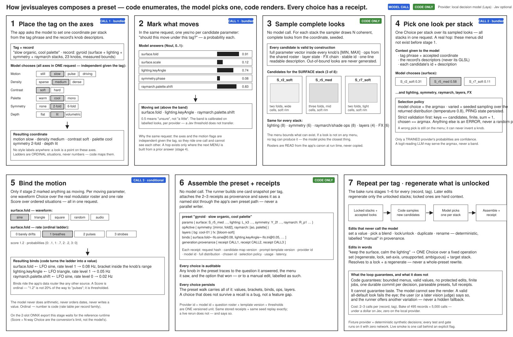

# jevisualeyes



**Prompt-first preset composer for fragment shaders.** Describe a look in one sentence — *"slow organic, cool palette, two folds"* — and a decision model (not a text generator) picks every choice from menus the code built: which axes the look sits on, which of the sampled complete looks each stack takes, what moves and how. Code renders the picks into a preset for an ISF fragment-shader record and its control stacks (ops · raymarch/shade ops · layers · FX · modulator binds). Every knob in the result traces to a persisted decision receipt, a labelled fixture, or a manual edit.

**Local model first.** The default provider is an open-weight decision model running on this machine over the `/v1/systemone` wire on loopback — no key, no network, no telemetry ([Laya](https://huggingface.co/convaiinnovations/laya) via [von](https://github.com/wfzyx/von) today). TypeSafe's Jev is an optional remote provider, never a requirement. The open reproductions of Jev are tracked here: **https://huggingface.co/spaces/multimodalart/jev-reproductions-tracker** — trained scoring heads (calibrated) are the only class that may arm a threshold; logit-reading LLM replicas serve the argmax only.

**Status: complete rewrite in progress.** This repository is an MIT fork of [cocktailpeanut/jevthoven](https://github.com/cocktailpeanut/jevthoven) (a music composer on the same principle). The composer engine survives — one decision loop, code-enumerated complete candidates, one Choice per unit, receipts, fixture provider, locks + regenerate-unlocked, resumable jobs, the provider adapter. Every music/MIDI module, the React/Tone.js UI and the Pinokio launcher are being culled; the domain becomes the A8os shader library. Plan: `roadmap/jevisualeyes-rework.md` and the judgment-layer spec `specs/ai/jev.md` in the A8os repo. Until the rewrite lands, everything below this line is the upstream Jevthoven README and describes the MUSIC tool, not this one.

---

## Upstream README (Jevthoven — being replaced)

Prompt-first symbolic-music studio. Describe music in one sentence — *"a wistful 3/4 waltz, soft keys over round bass, light swing"* — and a live TypeSafe Jev model decides every musical unit, sequentially, with a bounded rolling context (recent bars, motif, harmony plan) resent each step. The result is an editable multitrack composition you can play, reshape, and export.

**There is no offline composer, audio model, or hidden song library.** Every note traces to a persisted Jev decision (or a labeled fixture/manual edit).

## What it does

- One natural-language prompt → plan (meter, tempo, form, lanes) → instrument choice → harmony → phrase intent → per-lane groove parameters → complete-bar patterns, one Jev `Choice` call each; code renders every pick into notes.
- Piano-roll and arrangement editing: add/move/resize/delete/velocity/quantize, note and track locks, tempo/swing/instrument/volume/mute/transpose — deterministic edits never call the model.
- Plain-English revisions routed through Jev ("make the bass busier in the second half", "set tempo to 80 BPM").
- Region/lane regeneration and whole-piece variations as resumable jobs.
- Pause / resume / cancel / keep-or-discard for every generation job; jobs survive restarts.
- Browser playback via Tone.js, loop regions, complete-bar previews while generating.
- Local SQLite persistence; export project JSON and Standard MIDI Files; validated JSON import.
- **Fixture provider mode** for development — deterministic synthetic decisions, zero API credits.

## Requirements

- Node.js ≥ 22.16
- For live mode: a `TYPESAFE_API_KEY` (https://typesafe.ai). Fixture mode needs nothing.
- Live mode spends credits — roughly one request per lane-bar plus planning (~75–80 for a 16-bar 4-lane piece).

## Run it

### Pinokio (recommended)

[1-click install](https://pinokio.co/apps/github-com-cocktailpeanut-jevthoven)

### Manually

```bash
cd app
cp .env.example .env     # set TYPESAFE_API_KEY, or leave blank and use Settings/fixture mode
npm install
npm run build
npm start                # http://127.0.0.1:4318
```

Development mode (API + Vite hot reload): `npm run dev` → http://127.0.0.1:5173

### Tests

```bash
npm test            # unit + integration (no credits — fixture provider)
npm run typecheck   # strict TS
npm run build       # production web bundle
npm run test:e2e    # Playwright browser smoke (needs `npx playwright install` once)
npm run test:live   # ONE opt-in billable call — requires LIVE_JEV=1 + TYPESAFE_API_KEY
```

## API

All endpoints are JSON under `/api`. Mutations take a `commandId` for idempotency; stale `baseRevisionId` returns `409 revision_conflict`. Errors are `{code,message,retryable,details?}`.

| Method | Path | Purpose |
|---|---|---|
| GET | `/api/health` | version, provider mode, key configured |
| GET/POST | `/api/settings` | read/save provider mode + API key |
| GET/POST | `/api/projects` | list / create / import (`{project}`) |
| GET/DELETE | `/api/projects/:id` | detail (with accepted revision) / delete |
| POST | `/api/compose` | `{prompt}` → `{projectId,jobId}` |
| POST | `/api/projects/:id/jobs` | `{mode:compose\|variation\|regenerate,instruction,scope?}` |
| GET | `/api/jobs/:id` | status, cursors, usage, safe preview |
| GET | `/api/jobs/:id/events` | SSE stream (replays via Last-Event-ID) |
| POST | `/api/jobs/:id/pause\|resume\|cancel\|accept\|discard` | job control |
| POST | `/api/projects/:id/commands` | deterministic edits: `setTempo,setInstrument,setMute,setTrackGain,setSwing,transpose,addNote,moveNotes,resizeNotes,deleteNotes,setVelocity,quantize,setNoteLock,setTrackLock,duplicateRegion,rename` |
| POST | `/api/projects/:id/edits` | natural-language edit intent via Jev |
| POST | `/api/projects/:id/undo\|redo` | revision-chain navigation |
| GET | `/api/projects/:id/export?format=json\|midi` | portable project / SMF download |

### curl

```bash
# compose (fixture mode)
curl -X POST http://127.0.0.1:4318/api/compose \
  -H 'content-type: application/json' \
  -d '{"prompt":"gentle lo-fi waltz","commandId":"c1"}'

# poll job
curl http://127.0.0.1:4318/api/jobs/job_XXXX

# export MIDI once completed
curl -OJ "http://127.0.0.1:4318/api/projects/proj_XXXX/export?format=midi"
```

### JavaScript

```js
const r = await fetch('http://127.0.0.1:4318/api/compose', {
  method: 'POST', headers: {'content-type':'application/json'},
  body: JSON.stringify({prompt: 'dark synthwave', commandId: crypto.randomUUID()})
});
const {jobId, projectId} = await r.json();
const es = new EventSource(`http://127.0.0.1:4318/api/jobs/${jobId}/events`);
es.addEventListener('job.completed', () => es.close());
```

### Python

```python
import requests
job = requests.post('http://127.0.0.1:4318/api/compose',
                    json={'prompt':'dark synthwave','commandId':'py1'}).json()
print(requests.get(f"http://127.0.0.1:4318/api/jobs/{job['jobId']}").json()['status'])
```

## Repository layout

```
app/            self-contained application (server + web + core kernel)
  core/         deterministic kernel: canon/hash, time/swing, candidates,
                selection, score invariants, MIDI codec, edits, request builders
  server/       Express API, SQLite persistence, job runner, SSE, providers
  web/          React + Tone.js UI (prompt → generating → studio)
  fixtures/     labeled synthetic + hand-authored example data
  schemas/      JSON Schema contracts
  tests/        unit + integration tests (fixture provider; no credits)
  e2e/          Playwright browser smoke tests
pinokio.js/json install.js start.js reset.js update.js   launcher
SPEC.md docs/   product/engine/API/architecture specification
reference/      executable reference kernel the app was ported from
examples/       labeled synthetic request/response fixtures
VALIDATION.md   what was verified on the specification handoff
KNOWN_LIMITATIONS.md
```

## Data & privacy

Everything lives under `app/data/` (SQLite + settings). The API key is stored in `app/data/settings.json` (mode 0600) or supplied via env, is never served to the browser, and never appears in exports. Fixture output is labeled `fixture` in `generation.provenance` and shown with a badge in the UI.

See `KNOWN_LIMITATIONS.md` for what this build does *not* claim.
