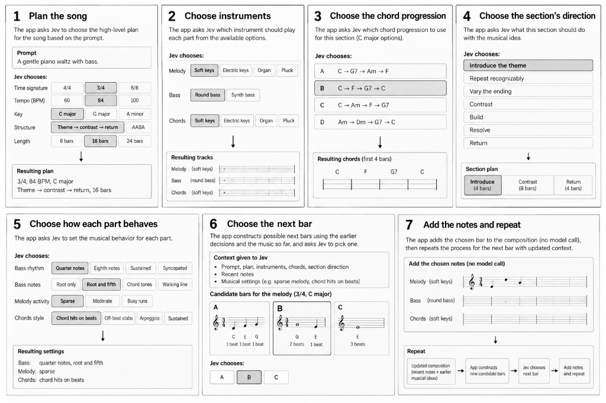

# 09 — How generation actually works: the decision menus



Jevthoven does not ask an AI to write notes. It asks Jev (a choice model) a series of
**multiple-choice questions**, then deterministic code renders the picks into a score.

Every question looks like this to the model:

```
state:      your prompt + plan + section + recent bars + harmony + cursor position
question:   "which of these options fits?"
criteria:   a list of 2–255 named options  ← this list is what the app controls
answer:     a probability per option + one chosen ID
```

The prompt steers **which option wins**. The menu bounds **what can exist**. If a sound
isn't on any menu, no prompt can produce it — the model picks the closest thing instead.

---

## The pipeline

```
your prompt
   │
   ├─ Q1  plan        → meter, key, style vocabulary, feel, form, density,
   │                    energy arc, which lanes exist, tempo, length
   ├─ Q2  instruments → one GM program per lane
   ├─ Q3  harmony     → one chord progression per section
   ├─ Q4  phrase      → one intent per section (build / resolve / return…)
   ├─ Q5  groove      → a rhythmic-parameter vector per lane per section
   └─ Q6  bars        → one whole-bar pattern per lane per bar  (the bulk of calls)
   │
   └─ code renders every pick into MIDI-like notes
```

Each decision is recorded with a receipt, so every note in the score traces back to
a question, the menu it saw, and the option that won.

---

## The complete menus

### Q1 — Plan (asked once per composition)

| Question | Options |
|---|---|
| meter | `4/4`, `3/4`, `6/8` |
| tonic | all 12 pitch classes (C … B) |
| harmonic vocabulary | `major`, `minor`, `blues_dominant`, `modal`, `chromatic_ambiguous` |
| feel | `straight`, `light_swing`, `shuffle` |
| form | `theme_contrast_return`, `AABA`, `blues_chorus`, `buildup_drop`, `sparse_evolving` |
| density | `sparse`, `medium`, `busy` |
| energy arc | `steady`, `rising`, `rise_fall`, `restrained_return` |
| lanes | all 15 non-empty subsets of `lead` `bass` `harmony` `drums`: lead · bass · harmony · drums · lead+bass · lead+harmony · lead+drums · bass+harmony · bass+drums · harmony+drums · lead+bass+harmony · lead+bass+drums · lead+harmony+drums · bass+harmony+drums · all four |
| tempo | 40–220 BPM (181 options; skipped if the prompt states one) |
| length | 4, 8, 12, 16, 24, 32, 48, 64 bars (skipped if stated) |

### Q2 — Instruments (one question per lane)

| Instrument | Program | Lanes |
|---|---|---|
| Electric keys | GM 4 | lead, harmony |
| Soft keys | GM 0 | lead, harmony |
| Organ | GM 16 | lead, harmony |
| Pluck | GM 24 | lead, harmony |
| Round bass | GM 33 | bass |
| Synth bass | GM 38 | bass |
| Soft lead | GM 80 | lead |
| Bright lead | GM 81 | lead |
| Drum kit | GM 0 | drums (auto-assigned) |

### Q3 — Harmony progression (one question per section)

The options depend on the vocabulary Jev chose in Q1. Shown as spelled-out chords
(e.g. `Am – F – C – G`); code tiles the chosen progression across the section's bars.

**minor** — i–VI–III–VII · i–iv–V–i · i–iv–i–V · i–VII–VI–V · i–V–VI–iv ·
i–III–VII–VI · i–iv–VII–III · i–VI–iv–V · i–i–iv–iv · static i · no chord

**major** — I–V–vi–IV · I–IV–V–I · I–vi–IV–V · I–V–IV–I · I–iii–IV–V ·
I–IV–I–V · I–vi–ii–V · I–ii–V–I · I–I–IV–IV · static I · no chord

**blues_dominant** — I7–IV7–I7–V7 · I7–IV7–I7–I7 · I7–V7–IV7–I7 ·
i7–iv7–i7–v7 · i7–iv7–V7–i7 · static I7 · no chord

**modal** — I–♭VII–IV–I · I–♭VII–♭VI–♭VII · i–♭VII–♭VI–♭VII ·
i–VII–i–VII · I–IV–I–♭VII · i–iv–i–i · static I · no chord

**chromatic_ambiguous** — i–♭II–i–V · i–iv–♭VI–V · i–♭VI–♭VII–i ·
i–iidim–i–V · i–♭II–♭VII–i · i–♭III–♭II–i · static i · no chord

### Q4 — Phrase intent (one question per section)

`introduce` · `repeat_recognizably` · `vary_ending` · `contrast` ·
`build` · `resolve` · `return`

### Q5 — Groove parameters (one request per section, one sub-question per lane-axis)

There are no named genres in the system. Instead, each lane answers a few
universal rhythmic questions; the answers form a parameter vector that defines
a *region* of bar-space. Code then samples concrete bar renderings from that
region (seeded per bar). Styles are coordinates — a bossa clave, a
four-on-the-floor, and an Alberti figure are all points the same axes can
reach. `any` leaves the axis unconstrained.

**drums** (4 axes):
- `kick`: `beats` · `driving` · `sparse` · `syncopated` · `off` · `any`
- `snare`: `backbeat` · `third` (half-time) · `syncopated` · `off` · `any`
- `hats`: `eighths` · `quarters` · `sixteenths` · `sparse` · `off` · `any`
- `accent`: `none` · `clave` (rim-click pattern) · `open_hat` · `crash` · `any`

**bass** (2 axes):
- `rhythm`: `quarters` · `eighths` · `dotted` (long–short) · `sustained` · `syncopated` · `any`
- `pitches`: `root` · `root_fifth` · `chord_tones` · `walking` · `any`

**harmony** (2 axes):
- `attack`: `block` · `comp` (off-beat stabs) · `arp` · `sustain` · `sparse` · `any`
- `density`: `full` · `light` · `any`

**lead** (2 axes):
- `density`: `sparse` · `medium` · `busy` · `any`
- `syncopation`: `onbeat` · `mixed` · `syncopated` · `any`

That is 10 sub-questions per section in a single request — the space they
span is combinatorial (e.g. bossa ≈ kick:sparse + snare:off + hats:eighths +
accent:clave + bass dotted root–fifth + comp harmony).

### Q6 — Bar pattern (one question per lane per bar)

Each option is a **complete bar** described in words, e.g.
`G5 960; G5 960` or `rest 480; D5 480; F5 960`. The candidates are *sampled
renderings from the lane's groove parameter point* — deterministic per seed —
voiced on the current chord and biased to continue from the lane's last note.
A `motif` option (replays the theme's opening bar) and a `hold` option
(sustain the previous note) are added when valid.

- **Lead** — rhythm skeletons from the lead table (26 across meters) are
  filtered by `density`/`syncopation`, then crossed with `arch`/`asc`/`desc`
  contours: ≈15–42 options per bar.
- **Bass** — ~12 sampled bars: an onset schedule drawn from `rhythm` × a
  pitch sequence drawn from `pitches` (root, root–fifth, chord tones with
  quality-aware third, stepwise walking).
- **Harmony** — ~8 sampled bars: onset patterns drawn from `attack` ×
  voicing size drawn from `density`.
- **Drums** — ~14 sampled masks at half-cell resolution: kick/snare/hat/
  accent layers drawn from their axes, merged and lightly humanized per
  seed (e.g. `accent:clave` yields rim-click cells 0-3-6 or 2-5-7).

*Fallback (mid-bar positions only)* — when the cursor is not bar-aligned
(partial regeneration, protected notes), the question instead lists atomic
events: every pitch/chord option × duration, plus `rest` and `hold` variants
(~50–175 options). Same mechanism, finer grain.

### Edit-time question (natural-language edits)

`operation`: setTempo · setInstrument · setTrackGain · setMute · transpose ·
setLocks · regenerate · duplicateRegion · unsupported · ambiguous —
plus `targetLane`, `scope`, and `direction` sub-questions.

---

## What this means in practice

- **The model supplies all the taste; the code supplies all the vocabulary.**
  The groove layer is where genre knowledge lands — but as *coordinates*, not
  authored genres. "Bossa nova" reaches (kick:sparse + clave accent + dotted
  root–fifth bass + comp); a style nobody named still gets a parameter point.
- **Coverage is combinatorial, not enumerated.** The axes multiply into
  hundreds of groove points; uncovered styles degrade to the nearest point or
  `any`, never to a refusal. Expanding coverage means adding an axis value or
  a renderer branch — not a new genre.
- **Every menu above is finite by design.** Validity, determinism, and
  per-note provenance all come from the fact that every possible answer is
  enumerated before the model sees it.
